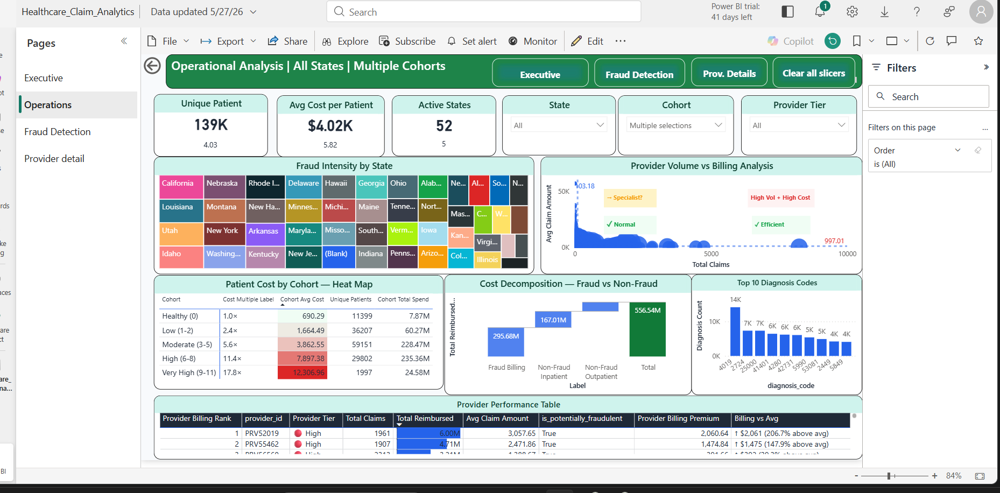

# 🏥 Healthcare Provider Fraud Detection V2

<div align="center">


### **End-to-end fraud detection analytics pipeline on real Medicare claims data**
### 558,211 Claims · 5,410 Providers · 226× Fraud Concentration Finding

[📥 Download Dashboard](dashboard/Healthcare_Claim_Analytics.pbix) · [🗄️ SQL Schema](#️-database-schema) · [🤖 ML Model](#-ml-model) · [☁️ Azure Pipeline](#️-azure-adf-pipeline)

</div>

---

## 📌 Project Summary

This project builds a **production-grade fraud detection pipeline** on the [Kaggle Healthcare Provider Fraud Detection dataset](https://www.kaggle.com/datasets/rohitrox/healthcare-provider-fraud-detection-analysis), covering **558,211 Medicare claims** across **5,410 providers** from 2008–2010.

> **Core Finding: Q4 billing providers (top 25% by total billing) are 226× more likely to be fraudulent than Q1 providers — 34.02% fraud rate vs 0.15%.**

The pipeline spans raw data ingestion → PostgreSQL star schema → Azure ADF orchestration → Python ML modeling → Power BI 4-page interactive dashboard with drill-through.

---

## 🔑 Key Findings

| Finding | Metric | Insight |
|---|---|---|
| **226× Billing Concentration** | Q1: 0.15% → Q4: 34.02% | Top billing quartile drives nearly all fraud |
| **Velocity Signal** | 96.08% precision | 96% of high-velocity providers (>10 claims/day) are fraud-flagged |
| **Diagnosis Stuffing** | 1.66× ratio | Fraud providers file 9.92% vs 5.99% claims with 9+ diagnosis codes |
| **ML Model Recall** | 90.1% | Logistic Regression catches 9 out of 10 fraud providers |
| **Cohort Cost Gradient** | 18.8× | Very High cohort costs $12,306 vs Healthy cohort $690 avg |
| **Fraud Exposure** | $295.68M | 53.1% of total $556.54M reimbursed linked to fraud providers |

---

## 🏗️ Architecture

```
┌──────────────────────────────────────────────────────────────────────┐
│                         DATA PIPELINE                                │
│                                                                      │
│  Kaggle CSV → Azure Blob Storage → Azure ADF → PostgreSQL → Views   │
│  (558K rows)   (Raw landing zone)  (Pipeline)  (9 tables)  (ML feats)│
└──────────────────────────────────────────────────────────────────────┘
                                    ↓
┌──────────────────────────────────────────────────────────────────────┐
│                        ANALYTICS LAYER                               │
│                                                                      │
│   Python (scikit-learn)     →     Power BI (4 pages)                 │
│   LR + XGBoost + RF               Executive | Operations |           │
│   AUC 0.9573 | Recall 90.1%       Fraud Detection | Provider Detail  │
└──────────────────────────────────────────────────────────────────────┘
```

---

## 📊 Dashboard — 4 Pages

### [📥 Download Dashboard (.pbix)](dashboard/Healthcare_Claim_Analytics.pbix)

| Page | Purpose | Key Visuals |
|---|---|---|
| **Page 1 — Executive** | C-suite portfolio overview | 6 KPI cards, combo trend chart, decomposition tree, key influencers, gauge |
| **Page 2 — Operations** | State/cohort operational view | US fraud map, provider scatter, cohort heatmap, waterfall, top 10 diagnosis |
| **Page 3 — Fraud Detection** | 226× hero analysis + ML results | Quartile bar chart, ML cards, velocity scatter, diagnosis stuffing, investigation queue |
| **Page 4 — Provider Detail** | Single-provider drill-through | Billing trend, risk flags, vs portfolio comparison, investigation verdict |

### 📸 Dashboard Screenshots

#### Page 1 — Executive Overview


#### Page 2 — Operations Analysis


#### Page 3 — Fraud Detection (226× Hero Finding)


#### Page 4 — Provider Detail (Drill-through)


---

## ☁️ Azure ADF Pipeline

Full cloud pipeline built on Azure — Blob Storage → Azure Data Factory → PostgreSQL (Aiven).

### Pipeline Screenshots

#### Resource Group Setup
"C:\Data science\Project\Healthcare-Insurance-Claims-Analytics\azure\screenshots\01_resource_group_initial.png"

#### PostgreSQL Initial Setup


#### Linked Services Configuration


#### ADF Pipeline Canvas


#### Pipeline Run — Success (5,410 rows)


#### ADF Monitor History


---

## 🗄️ Database Schema

**PostgreSQL — 9 tables, 2.43M total rows**

```
dim_beneficiary          (138,556 rows)  — Patient demographics + chronic conditions
dim_provider             (  5,410 rows)  — Provider fraud labels
dim_date                 (  1,096 rows)  — Date dimension
dim_diagnosis_code       (  2,213 rows)  — ICD-9 codes
fact_inpatient_claims    ( 40,474 rows)  — Inpatient claim records
fact_outpatient_claims   (517,737 rows)  — Outpatient claim records
bridge_claim_diagnosis   (1,710,000 rows)— Claim ↔ diagnosis mapping
v_provider_features      (  5,410 rows)  — ML feature view (28 engineered features)
v_patient_risk_score     (138,556 rows)  — Patient risk scoring view
```

**Key Engineered Features (`v_provider_features`):**

| Feature | Signal Type |
|---|---|
| `avg_daily_claims` | Velocity anomaly |
| `peak_daily_claims` | Outlier velocity |
| `claims_with_9plus_diagnoses` | Diagnosis stuffing |
| `avg_patient_chronic_count` | Patient complexity proxy |
| `coefficient_of_variation` | Billing inconsistency |
| `avg_patient_risk_score` | Composite patient risk |
| `distinct_attending_physicians` | Physician concentration |

---

## 🤖 ML Model

**Task**: Binary classification — predict `is_potentially_fraudulent` (provider level)

**Training**: 4,328 providers | **Test**: 1,082 providers | **Base fraud rate**: 9.35%

| Model | AUC | Recall (Fraud) | Precision (Fraud) | F1 |
|---|---|---|---|---|
| **Logistic Regression (balanced)** | **0.9573** | **90.1%** | **40.4%** | **0.558** |
| XGBoost | 0.9089 | 65.4% | 58.1% | 0.615 |
| Random Forest | 0.8934 | 61.2% | 55.3% | 0.581 |

> **Why Logistic Regression won**: In fraud detection, recall is the priority metric — missing a fraudulent provider costs far more than a false positive review. LR with `class_weight='balanced'` achieves **90.1% recall** vs XGBoost's 65.4%, catching **26 more fraud providers** per review cycle at the cost of more false positives.

**Investigation Queue**: 225 providers flagged per cycle (91 True Positives + 134 False Positives).

---

## 🛠️ Tech Stack

| Layer | Technology |
|---|---|
| **Data Ingestion** | Azure Data Factory (ADF) |
| **Cloud Storage** | Azure Blob Storage |
| **Database** | PostgreSQL 15 (Aiven cloud) |
| **Feature Engineering** | PostgreSQL views + window functions |
| **ML Pipeline** | Python — scikit-learn, pandas, numpy, matplotlib |
| **Visualization** | Microsoft Power BI Desktop |
| **Version Control** | Git + GitHub |

---

## 📁 Repository Structure

```
Healthcare-Insurance-Claims-Analytics/  (branch: v2-real-data)
│
├── azure/                              # Azure ADF pipeline screenshots
│   ├── 01_resource_group_initial.png
│   ├── 01_PostgresSQL_initial.png
│   ├── 02_linked_services.png
│   ├── 03_pipeline_canvas.png
│   ├── 04_pipeline_run_success.png
│   └── 05_adf_monitor_history.png
│
├── sql/                                # PostgreSQL schema + queries
│   ├── schema/                         # CREATE TABLE statements
│   ├── views/                          # v_provider_features, v_patient_risk_score
│   └── powerbi_reporting_views.sql
│
├── python/                             # ML pipeline notebooks
│   ├── 01_eda.ipynb
│   ├── 02_feature_engineering.ipynb
│   ├── 03_ml_models.ipynb              # LR vs XGBoost vs RF comparison
│   └── 04_shap_analysis.ipynb
│
├── dashboard/                          # Power BI files + screenshots
│   ├── Healthcare_Claim_Analytics.pbix # 4-page dashboard (Git LFS)
│   ├── Executive command center.png
│   ├── Fraud Dectection.png
│   ├── Operations.png
│   └── Provider Id Details.png
│
└── README.md
```

---

## 🚀 How to Run

### Prerequisites
```bash
pip install pandas numpy scikit-learn matplotlib seaborn psycopg2
```

### 1. Database Setup
```sql
-- Run in order:
-- sql/schema/01_create_tables.sql
-- sql/schema/02_create_views.sql
```

### 2. Load Data
```bash
psql -h <host> -U <user> -d healthcare_v2 -f sql/schema/01_create_tables.sql
```

### 3. Run ML Pipeline
```bash
jupyter notebook python/03_ml_models.ipynb
```

### 4. Open Dashboard
```
Open dashboard/Healthcare_Claim_Analytics.pbix in Power BI Desktop
```

---

## 💡 DAX Highlights

```dax
-- 226× Fraud Concentration Finding
Quartile Fraud Rate =
DIVIDE(
    CALCULATE(
        DISTINCTCOUNT('public v_provider_features'[provider_id]),
        'public v_provider_features'[label] = 1
    ),
    DISTINCTCOUNT('public v_provider_features'[provider_id]),
    0
)

-- Composite 6-Level Risk Flag
Risk Flag =
VAR IsQ4      = 'public v_provider_features'[Billing Quartile] = "Q4 (Highest)"
VAR IsVelocity = 'public v_provider_features'[peak_daily_claims] > 10
VAR IsFraud   = 'public v_provider_features'[label] = 1
RETURN
SWITCH(TRUE(),
    IsFraud && IsQ4 && IsVelocity, "CRITICAL",
    IsFraud && IsQ4,               "HIGH RISK",
    IsFraud && IsVelocity,         "FRAUD + VELOCITY",
    IsFraud,                       "FRAUD FLAGGED",
    IsQ4 && IsVelocity,            "MONITOR CLOSELY",
    IsQ4,                          "ELEVATED",
                                   "NORMAL")
```

---

## 📬 Contact

**Sumit Kumar Prajapat**

- 🔗 GitHub: [github.com/Skpkush](https://github.com/Skpkush)
- 💼 LinkedIn: [linkedin.com/in/sumit-kumar-prajapat](https://linkedin.com/in/sumit-kumar-prajapat)
- 🏅 Certifications: PL-300 · AZ-900 · DP-900 · AWS Cloud Practitioner

---

<div align="center">

**⭐ Star this repo if you found it useful!**

*Real Medicare data · End-to-end pipeline · Production-grade dashboard · 226× fraud finding*

</div>
